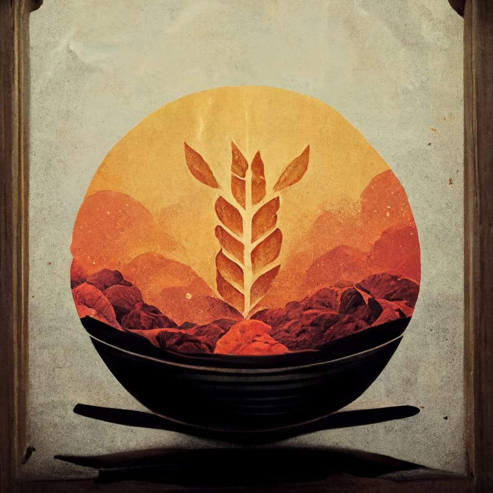
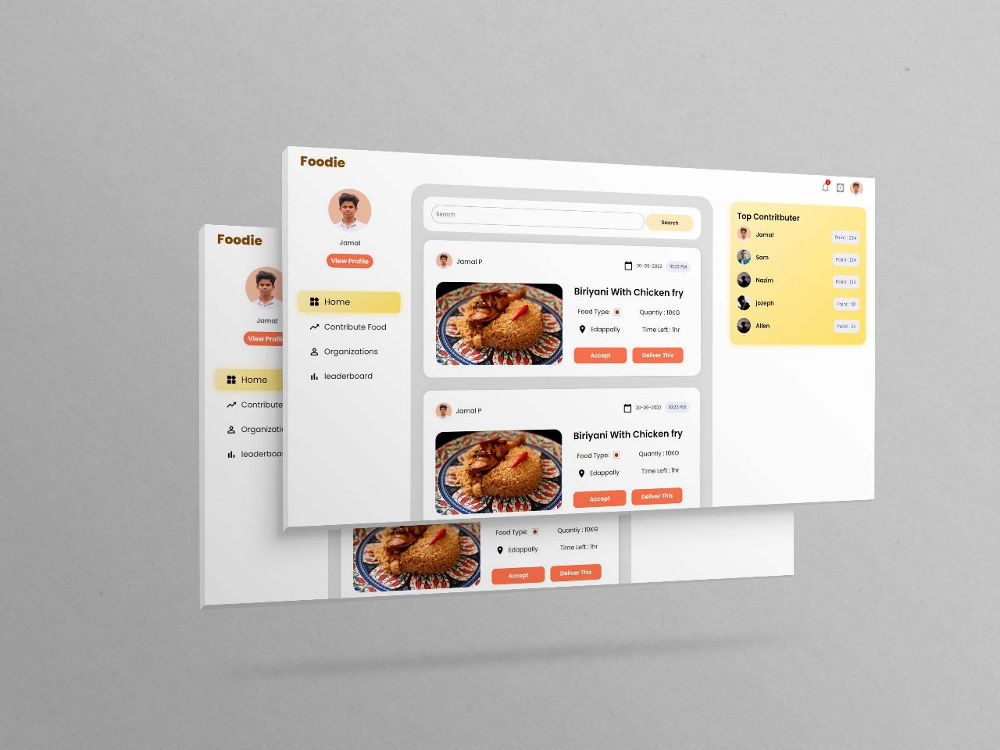

<!--
*** Thanks for checking out the Best-README-Template. If you have a suggestion
*** that would make this better, please fork the repo and create a pull request
*** or simply open an issue with the tag "enhancement".
*** Don't forget to give the project a star!
*** Thanks again! Now go create something AMAZING! :D
-->

<!-- PROJECT LOGO -->

  

  <h1 align="center">Bon Appetit</h1>
  <h2 align="center"> Where Hunger Stops.</h2>

  

    A platform for the good-hearted!
     
    <a href="https://bonappletea.netlify.app"><strong>Check Out Our Web App. »</strong></a>
     
     
  
  

<!-- TABLE OF CONTENTS -->

  
Table of Contents

  <ol>
    <li>
      <a href="#about-the-project">About The Project</a>
      <ul>
        <li><a href="#built-with">Built With</a></li>
      </ul>
    </li>
    <li>
      <a href="#getting-started">Getting Started</a>
      <ul>
        <li><a href="#prerequisites">Prerequisites</a></li>
        <li><a href="#installation">Installation</a></li>
      </ul>
    </li>
    <li><a href="#usage">Usage</a></li>
    <li><a href="#roadmap">Roadmap</a></li>
    <li><a href="#contributing">Contributing</a></li>
    <li><a href="#license">License</a></li>
    <li><a href="#contact">Contact</a></li>
    <li><a href="#acknowledgments">Acknowledgments</a></li>
  </ol>

<!-- ABOUT THE PROJECT -->
## About The Project
 

Did you know that about 40 % of the food produced in India is wasted?
Despite adequate food production, the UN has reported that about 190 million Indians remain undernourished. It is further estimated that the
value of food wastage in India is around ₹92,000 crores per annum.
These are some bleak statistics, but they should help us realise the magnitude of the problem of food waste, as much as inequity, in India.
The world recognises that no truly sustainable and developed country can exist without tackling the issue of food waste, and while the challenge
in front of us may be monumental, some steps need to be taken sooner than others.

This is why we came up with the idea of Bon Appetit.
Bon Appetit is a small intiative trying to solve the problems of food wastage and hunger by providing a platform which connects people with excess food or people who are willing to contribute food to Non-Profit-Organizations.

People who are willing to donate food have said to have faced the following problems

* They do not know many organizations who accepts food donations.
* They do not know how to find a nearby organization.
* Transportation difficulties.

Our platform aims to solve all these problems by 
* Making the nearby NGO's visible to all.
* The people can create requests on how much availabe food they have and the organizations can accept it.
* Delivery is also done by volunteers. (Or using other delivery partners)
* Organizations can create request on how much food they need.
* Top Contributers get their name on the leaderboard.

(<a href="#readme-top">back to top</a>)

### Built With

</img>

(<a href="#readme-top">back to top</a>)

<!-- ROADMAP -->
## Roadmap
- [x] Email sent on accepting request.
- [x] Add Upload photo feature
- [ ] Add map feature
- [ ] Add Multi language support

<!-- CONTACT -->
## Contact

Jozef Antony - [@jzf21](https://github.com/jzf21) - jozefneelamkavil2003@gmail.com 

Nazim Filzer - [@NzM](https://github.com/NazimFilzer) - nazimfilzer@gmail.com 

Allen Shibu - [@alapanoski](https://github.com/alapanoski) - allenshibu@outlook.com 

Jamal J - [@jamaljm](https://github.com/jamaljm) - jamalvga2002@example.com

Project Link: [https://github.com/jamaljm/BonAppetit](https://github.com/jamaljm/BonAppetit)

(<a href="#readme-top">back to top</a>)

<!-- ACKNOWLEDGMENTS -->
## Acknowledgments

(<a href="#readme-top">back to top</a>)

